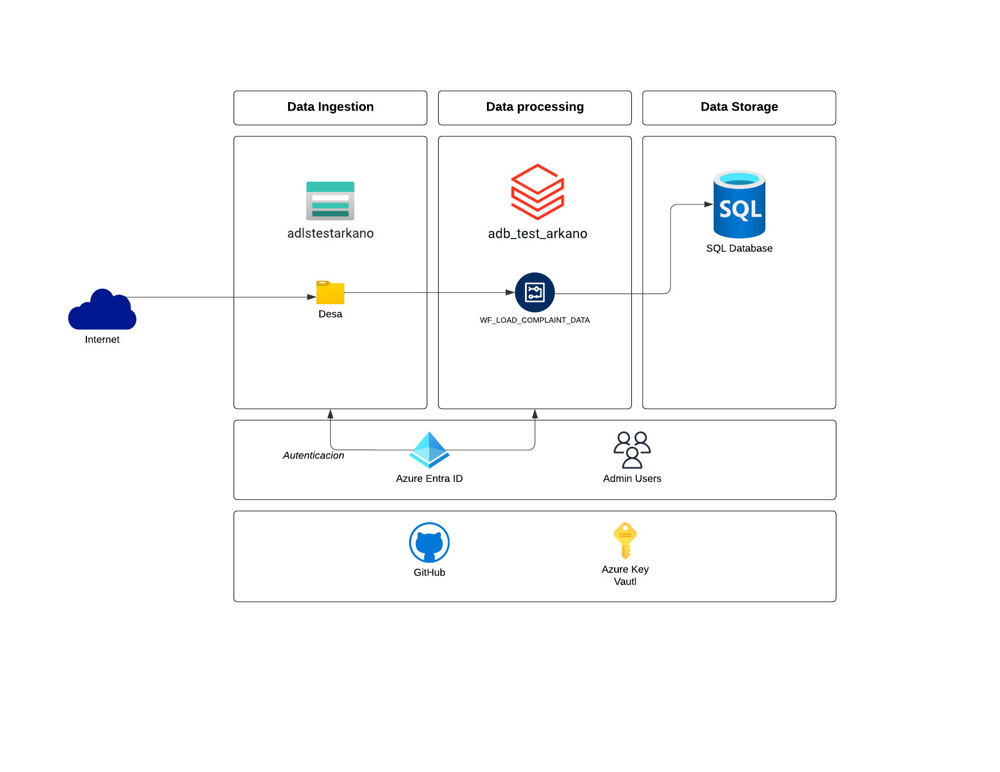

# ArkanoTest
# Proyecto ETL con Azure Data Lake Storage, Databricks y SQL Server

## Descripción del Proyecto

Este proyecto está diseñado para realizar un proceso ETL (Extract, Transform, Load) donde se carga un archivo en Azure Data Lake Storage (ADLS), se consume y transforma utilizando un workflow de Databricks configurado con un trigger que se activa cuando en el contenedor se carga un archivo. Finalmente se carga en una base de datos SQL Server desde el mismo databricks por medio de una conexón jdbc. A continuación, se detallan los pasos de configuración necesarios para llevar a cabo este proyecto.


## Requisitos Previos

1. **Cuenta de Azure**: Una suscripción activa de Azure.
2. **Azure Data Lake Storage (ADLS)**: Un contenedor en ADLS para almacenar los archivos de entrada.
3. **Azure Databricks**: Un workspace y un clúster de Databricks.
4. **Azure SQL Server**: Un servidor SQL y una base de datos en Azure.
5. **Azure Key Vault**: Un Key Vault para almacenar las credenciales de acceso de forma segura.

## Pasos de Configuración

### 1. Configuración de Azure Data Lake Storage (ADLS)

1. **Crear una cuenta de almacenamiento**:
   - Ve al portal de Azure y selecciona "Crear un recurso".
   - Busca "Storage account" y sigue las instrucciones para crear una nueva cuenta de almacenamiento.

2. **Crear un contenedor**:
   - Dentro de tu cuenta de almacenamiento, navega a "Containers" y crea un nuevo contenedor para almacenar los archivos de entrada.

3. **Subir archivos**:
   - Sube el archivo que deseas procesar al contenedor creado.

Más detalle hasta aquí, en: https://learn.microsoft.com/es-es/azure/storage/blobs/create-data-lake-storage-account

### 2. Configuración de Azure SQL Server

1. **Crear un SQL Server y una base de datos**:
   - En el portal de Azure, selecciona "Crear un recurso" y busca "SQL Server".
   - Sigue las instrucciones para crear un nuevo servidor SQL.
   - Dentro del servidor SQL, crea una nueva base de datos.

Más detalle en: https://learn.microsoft.com/es-es/azure/azure-sql/database/single-database-create-quickstart?view=azuresql&tabs=azure-portal

### 3. Configuración de Microsoft Entra ID

1. **Registrar aplicaciones**:
   - En el portal de Azure, busca el servicio "Microsoft Entra ID".
   - Una vez dentro, en el apartado "Administrar" busca la opción "Registros de aplicaciones".
   - Selecciona "Nuevo registro", coloca un nombre para identificar la aplicación y dar en "Registrar".
   
2. **Crear secreto de cliente**:
   - Después del paso anterior aparecerá la aplicacion registrada, pulsar sobre el nombre.
   - Se despliega una ventana, buscar el apartado "Administrar" la opción "Certificados y secretos".
   - Pulsar "Nuevo secreto de cliente", coloca un nombre para identificarlo.
   - Inmediatamente después, copiar el valor del secreto y guardarlo en un block de notas.

### 4. Configuración de Azure Key Vault

1. **Crear un Key Vault**:
   - En el portal de Azure, selecciona "Crear un recurso" y busca "Key Vault".
   - Sigue las instrucciones para crear un nuevo Key Vault.

2. **Agregar secretos al Key Vault**:
   - Navega a tu Key Vault y en la sección de "Secrets", selecciona "Generate/Import".
   - Añade los siguientes secretos:
     - `sql-username`: El nombre de usuario de SQL Server.
     - `sql-password`: La contraseña de SQL Server.
     - `adls-secret-1`: El valor del secreto de la cuenta de almacenamiento como entidad administrada. Aquí agregar el secreto que se guardo en pasos anteriores. 

### 5. Configuración de Azure Databricks

1. **Crear un workspace y un clúster**:
   - Ve a tu instancia de Databricks.
   - Navega a "Clusters" y crea un nuevo clúster.

2. **Configurar Scope de Databricks**:
   - Ir a https://<databricks-instance>#secrets/createScope. Reemplace <databricks-instance> por la URL de su servicio, para ello puede buscar en la opción "Informacion general"
   - Escriba el nombre del ámbito de secretos. Los nombres de ámbito de los secretos no distinguen mayúsculas de minúsculas.
   - Escriba el nombre DNS del servicio y el identificador del recurso key vault creado anteriormente, para ello en el recurso buscar la opción "Propiedades", copiar "URi de almacén" y pegar en la parte de DNS, copiar "Id. del recurso" y pegar en la parte del Resource ID.
   - Guardar el nombre del scope en un block de notas y dar en "Crear"

2. **Configurar Databricks para usar Azure Key Vault**:
   - En el portal de Azure, ve a tu Key Vault y selecciona "Control de acceso (IAM)".
   - Agrega una asignación de roles, con rol "Lector" para tu conector de acceso para Azure Databricks, (buscarlo en el portal de azure para saber el nombre exacto).

3. **Montar ADLS en Databricks**:
   - En un notebook de Databricks, usa el siguiente código para montar ADLS:
     ```python
        service_credential = dbutils.secrets.get(scope="<secret-scope>",key="<service-credential-key>")

        spark.conf.set("fs.azure.account.auth.type", "OAuth")
        spark.conf.set("fs.azure.account.oauth.provider.type", "org.apache.hadoop.fs.azurebfs.oauth2.ClientCredsTokenProvider")
        spark.conf.set("fs.azure.account.oauth2.client.id", "<application-id>")
        spark.conf.set("fs.azure.account.oauth2.client.secret", service_credential)
        spark.conf.set("fs.azure.account.oauth2.client.endpoint", "https://login.microsoftonline.com/<directory-id>/oauth2/token")
     ```
    Reemplazar:
        - <secret-scope> por el nombre del ámbito de secreto de Databricks.
        - <service-credential-key> por el nombre de la clave que contiene el secreto de cliente.
        - <application-id> por el Id. de aplicación (cliente) de la aplicación de Microsoft Entra ID.
        - <directory-id> por el Id. de directorio (inquilino) de la aplicación de Microsoft Entra ID.
    
    - Después de ejecutar ya se tiene acceso a ADLS desde Databricks.

### 5. Conectar Databricks a SQL Server

1. **Configurar la cadena de conexión**:

    ```python
    jdbcUrl='jdbc:sqlserver://arkanoserver.database.windows.net:1433;database=db_arkano_test'

    sql_username = dbutils.secrets.get(scope="kv-secret-adls", key="sql-username")
    sql_password = dbutils.secrets.get(scope="kv-secret-adls", key="sql-password")
    ```

2. **Escribir datos usando la cadena de conexión**:

    ```python

    # Escribir datos a SQL Server
    transformed_df.write \
        .format("jdbc") \
        .option("url", jdbc_url) \
        .option("dbtable", "your_table_name") \
        .option("driver", "com.microsoft.sqlserver.jdbc.SQLServerDriver") \
        .mode("append") \
        .save()
    ```

### 6. Crear y configurar Work Flow de Databricks

1. **Crear Work Flow**:
    - En Databricks ir a la opción "Flujos de trabajo", seleccionar "Crear trabajo".
    - Colocar un nombre al trabajo y a la tarea que se crea por defecto.
    - Seleccionar en Tipo: "Cuaderno", Fuente: "Workspace", en Ruta especificar la ubicación del Notebook creado que contienen todas las transformaciones y la carga a sql (en mi caso es load_csv_complaint_to_sql.py), seleccionar el cluster por defecto y darle en "Crear tarea"

2. **Configurar Work Flow**:
    - Una vez creado el workflow ingresar a el y buscar el apartado "Programación y activadores".
    - Ir a "Añadir trigger", en tipo de trigger seleccionar "Llegada de archivos", luego especificar la ruta del contenedor donde se cargaron los archivos, comprobar la conexión y Guardar.


### Conclusión y posibles mejoras

Siguiendo estos pasos, habrás configurado un entorno completo de ETL en Azure utilizando ADLS, Databricks y SQL Server. Este proceso te permitirá cargar archivos, limpiarlos y transformarlos en Databricks, y finalmente almacenarlos en una base de datos SQL Server. El proceso se activará mediante un trigger de llegada de archivos.

Como mejora se podría considerar utilizar servicios adicionales o librerías adcionales para poder automatizar incluso la carga del archivo desde el momento en que se descarga al local, podría ser tal vez un Datafactory autohospedado que pueda cargar los archivos locales a ADLS.